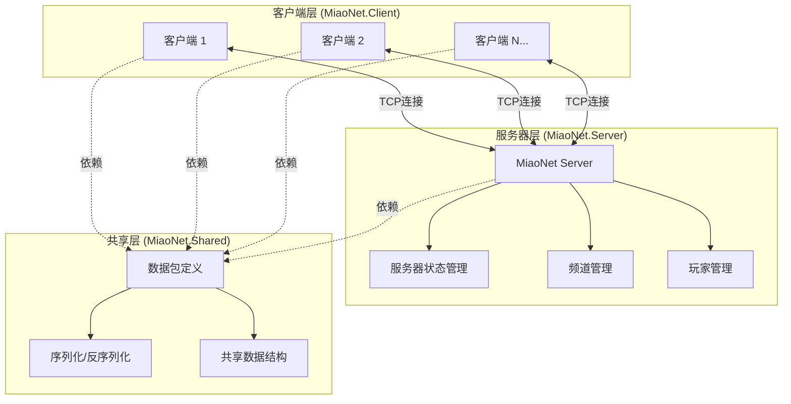
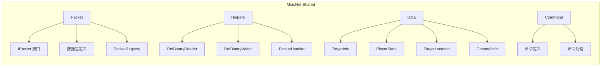
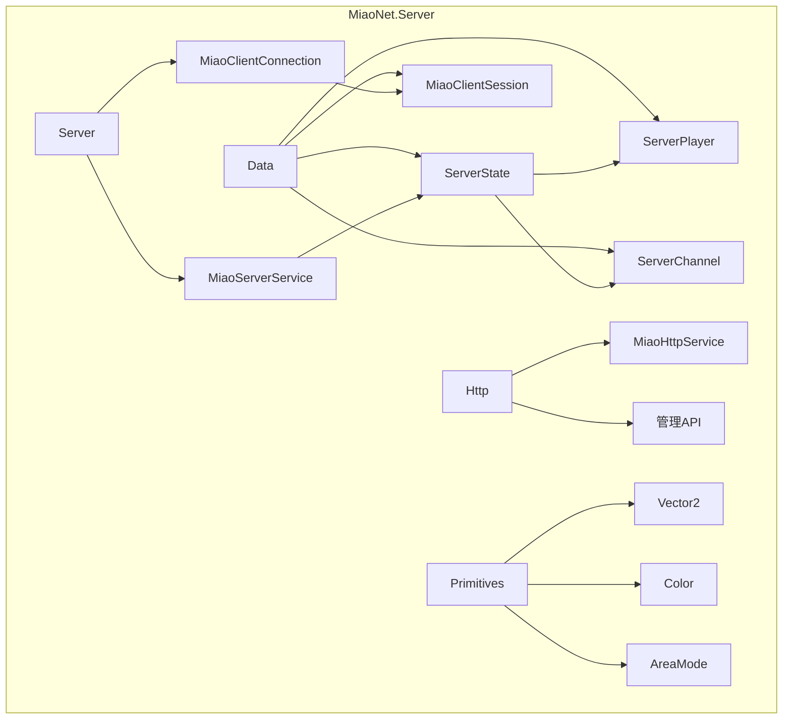
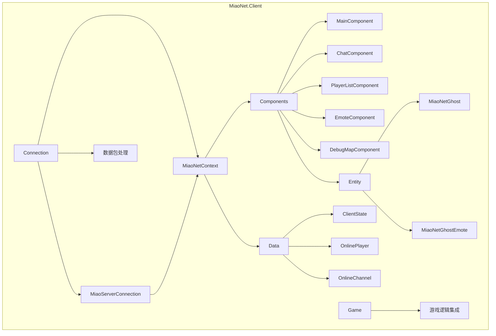
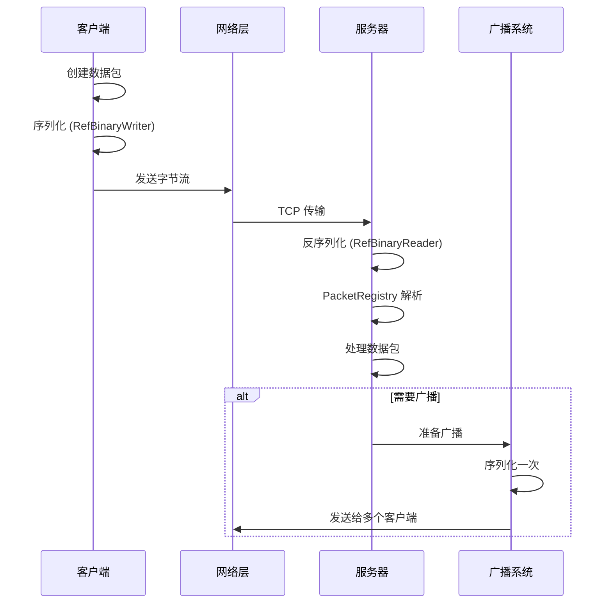
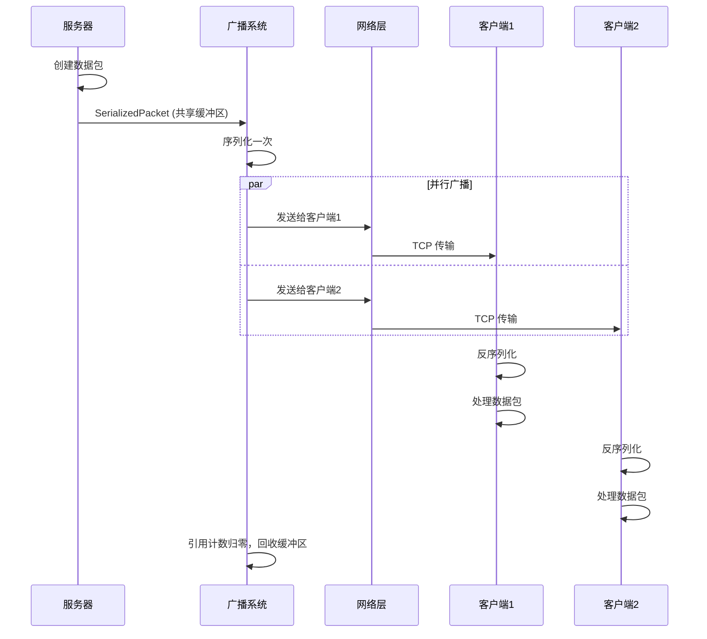

# MiaoNet 架构设计

本文档详细描述 MiaoNet 的整体架构设计、模块划分和核心设计理念。

## 系统架构概览

## 项目结构

MiaoNet 项目由以下几个主要模块组成：

### 1. MiaoNet.Shared (共享库)

共享库包含客户端和服务器都需要的代码，确保双方使用相同的数据结构和协议定义。

**主要组件：**

- **Packet/**: 所有数据包定义和注册表
  - `IPacket`: 数据包接口
  - `PacketRegistry`: 数据包类型注册和反射机制
  - `Packets/`: 具体的数据包实现
- **Helpers/**: 辅助工具类
  - `RefBinaryReader/Writer`: 二进制序列化，避免了 BinaryReader 等的堆开销
  - `PacketHandler`: 数据包处理器框架
- **Data/**: 共享数据结构
  - 玩家信息、状态、位置等核心数据类型

### 2. MiaoNet.Server (服务器)

服务器负责管理所有客户端连接、频道、玩家状态同步和消息广播。

**主要组件：**

- **Server/**: 核心服务器逻辑
  - `MiaoServerService`: 服务器主服务，管理所有连接
  - `MiaoClientConnection`: 单个客户端连接的管理
- **Data/**: 服务器特有数据
  - `ServerState`: 全局服务器状态（部分不可变设计，原子更新）
  - `ServerPlayer`: 服务器端的玩家表示
  - `ServerChannel`: 频道管理
- **Http/**: HTTP 管理接口
  - 提供服务器管理后台 API
- **Primitives/**: 基础类型定义
  - 客户端没有的结构体和枚举

**并发控制设计：**

服务器采用乐观并发控制策略：
- 在线玩家列表、频道列表等部分使用不可变类型
- 通过原子操作进行状态更新
- 减少锁的使用，提高并发性能

### 3. MiaoNet.Client (客户端)

客户端作为 Celeste 游戏的 Mod 运行，负责与服务器通信、渲染其他玩家和处理用户交互。

**主要组件：**

- **Connection/**: 网络连接管理
  - `MiaoServerConnection`: 与服务器的连接（不一定基于 TCP，可能会抽象出不依赖 TCP 的部分）
  - `MiaoNetContext`: 客户端上下文，管理在线状态
- **Components/**: UI 和功能组件
  - `MainComponent`: 主控制组件
  - `ChatComponent`: 聊天功能
  - `PlayerListComponent`: 玩家列表显示
  - `EmoteComponent`: 表情系统
  - `DebugMapComponent`: 调试地图特殊处理
- **Entity/**: 游戏实体
  - `MiaoNetGhost`: 其他玩家的实体表示
  - `MiaoNetGhostEmote`: 玩家表情实体
- **Data/**: 客户端特有数据
  - `ClientState`: 客户端状态
  - `OnlinePlayer`: 在线玩家表示

**线程模型：**

客户端使用单线程模型：
- 所有游戏逻辑在主线程执行
- 网络 I/O 在独立线程，通过队列与主线程通信
- 使用 `SingleThreadedSynchronizationContext` 避免让游戏使用线程池

### 4. ChatInputBox (聊天组件)

独立的聊天输入和历史记录库，可被其他项目复用。

## 数据流架构

### 客户端到服务器

### 服务器到客户端

## 核心设计理念

### 1. 高性能序列化

使用 `RefBinaryReader` 和 `RefBinaryWriter` 实现零分配或低分配的序列化：
- 使用 `ref struct` 避免堆分配
- 使用 `Span<byte>` 进行高效的内存操作
- 利用栈内存 (`stackalloc`) 减少 GC 压力

### 2. 数据包注册系统

通过 `PacketRegistry` 实现自动的数据包类型注册：
- 编译时通过 Attribute 标记数据包类型
- 运行时自动生成类型 ID 到反序列化器的映射
- 支持快速的数据包解析和派发

### 3. 不可变状态设计

服务器端采用不可变数据结构：
- 状态更新通过创建新对象而非修改现有对象
- 使用原子操作 (`Interlocked`) 进行状态切换
- 简化并发控制，避免复杂的锁机制

### 4. 优化的广播机制

服务器广播使用 `SerializedPacket`:
- 序列化一次，发送多次
- 使用 `ArrayPool` 管理内存
- 引用计数自动回收缓冲区

## 扩展性设计

### 组件化架构

客户端使用组件化设计，便于功能扩展：
- 每个功能作为独立的 Component
- 通过 `MiaoNetContext` 进行组件通信
- 可以轻松添加新的功能组件

### Mod 支持（计划中）

为未来的 Mod 支持预留接口：
- 握手阶段交换 Mod 列表
- 支持自定义数据包
- 支持自定义命令

## 性能考虑

### 内存管理

- 使用对象池减少 GC 压力
- 避免不必要的字符串分配
- 使用 `Span<T>` 和 `Memory<T>` 进行零拷贝操作

### 网络优化

- 数据包大小限制在 64KB 以内
- 批量发送减少系统调用
- 使用紧凑的二进制格式

### 并发处理

- 服务器使用异步 I/O
- 无锁数据结构减少竞争
- 工作负载在线程池中分散

## 安全性考虑

### 当前实现

- 基于 TCP 的可靠传输
- 客户端版本验证
- 基本的 Mod 列表验证

### 未来计划

- TLS 加密层（计划中）

## 相关文档

- [通信协议 (Protocol.md)](./Protocol.md) - 详细的协议说明
- [连接流程 (Connection.md)](../Connection.md) - 连接建立过程
- [数据结构 (DataStructures.md)](./DataStructures.md) - 数据结构参考
