# MiaoNet 连接流程

本文档详细描述 MiaoNet 客户端与服务器之间的连接建立过程和状态管理。

更详细的协议说明请参考 [通信协议文档 (Protocol.md)](./Protocol.md)。

## 连接流程概览

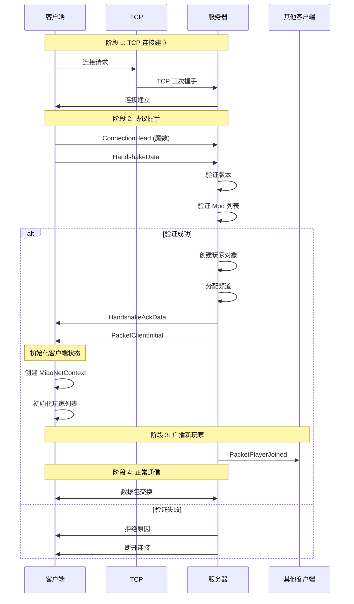

## 协议详解

### 1. Handshake & Initialization

> 暂时还没有做 TLS 加密层, 以后加了就是简单套一层

#### 步骤 1: 客户端发起握手

客户端发送 `ConnectionHead` 以及 `HandshakeData`:

**HandshakeData 包含:**
- 客户端版本 (`Version`)
- 语言代码 (`LangCode`)
- 玩家名称 (`Name`)
- 安装的 Mod 列表 (`NetMods[]`)

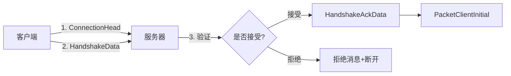

#### 步骤 2: 服务器验证

服务器根据 `HandshakeData` 信息决定是否接受连接:

**验证项目:**
1. 协议版本是否兼容
2. 玩家名称是否有效
3. Mod 列表是否可接受
4. 服务器是否已满

**接受连接:**
1. 创建 `ServerPlayer` 对象
2. 分配默认频道（通常是频道 0）
3. 发送 `HandshakeAckData` 确认
4. 发送 `PacketClientInitial` 初始化数据

**拒绝连接:**
- 如果 `ConnectionHead` 不正确: 直接断开连接
- 如果验证失败: 发送拒绝原因后断开连接

#### 步骤 3: 客户端初始化

客户端接收 `PacketClientInitial` 并初始化:

**PacketClientInitial 包含:**
- 玩家自身信息: `PlayerInfo` (ID, Name)
- 频道列表: `ChannelInfo[]` (ID, Name)
- 在线玩家列表: `Player[]`
  - `PlayerInfo`: 昵称等元信息
  - `PlayerLocation`: 所在地图、房间名 (MapSid, MapRoom)
  - `PlayerGraphicsInfo?`: 图形信息（可选）
  - `PlayerState?`: 状态信息（可选）

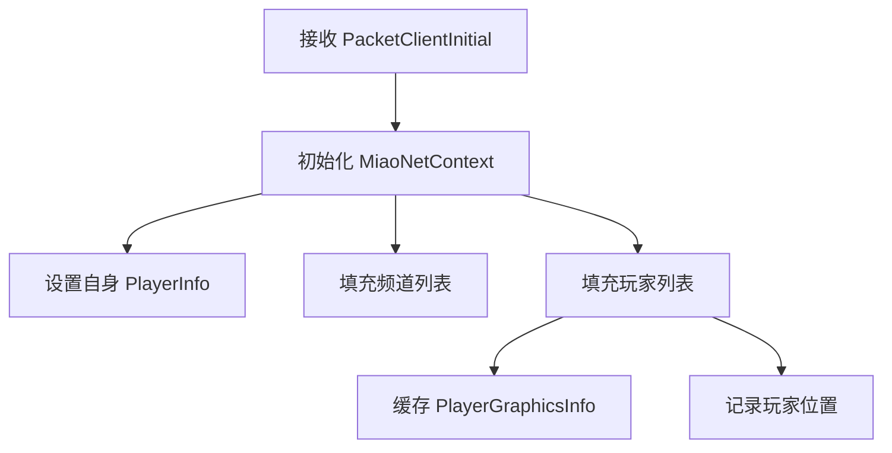

#### 步骤 4: 广播新玩家

服务器向其他客户端广播新玩家加入:

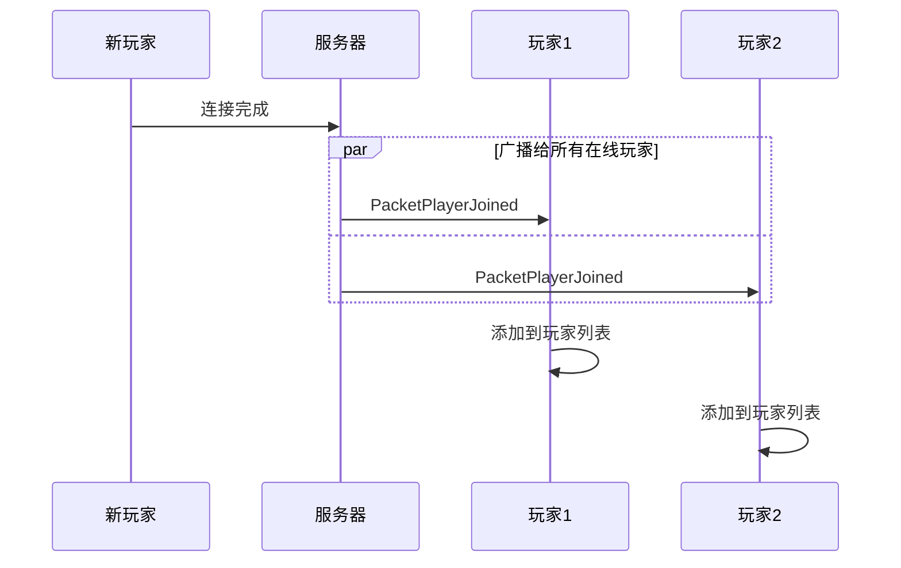

### 2. 地图变更导致的同步

#### 位置状态定义

客户端可能处于以下位置状态:

| 状态 | MapSid | MapRoom | 说明 |
|------|--------|---------|------|
| **InMap** | 非空 | 非空 | 在普通地图的房间中 |
| **InDebugMap** | 非空 | 空字符串 | 在调试地图 |
| **None** | 空字符串 | 空字符串 | 不在地图（主菜单等） |

> 注: 可能有 mod 会暂时离开 `Level` 但仍然算作在这个图里

#### 地图变更流程

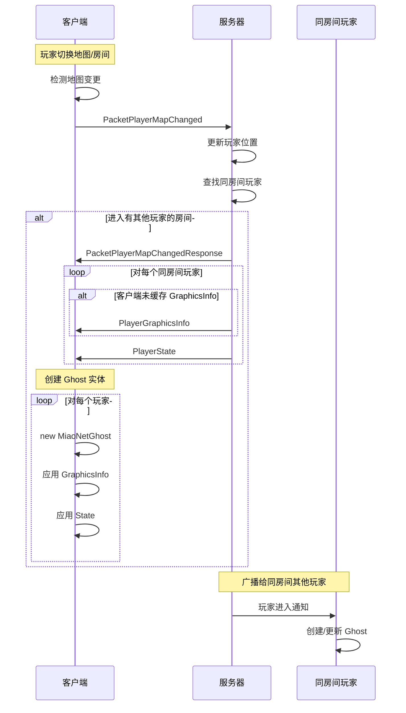

#### 详细步骤说明

**客户端发送位置更新:**
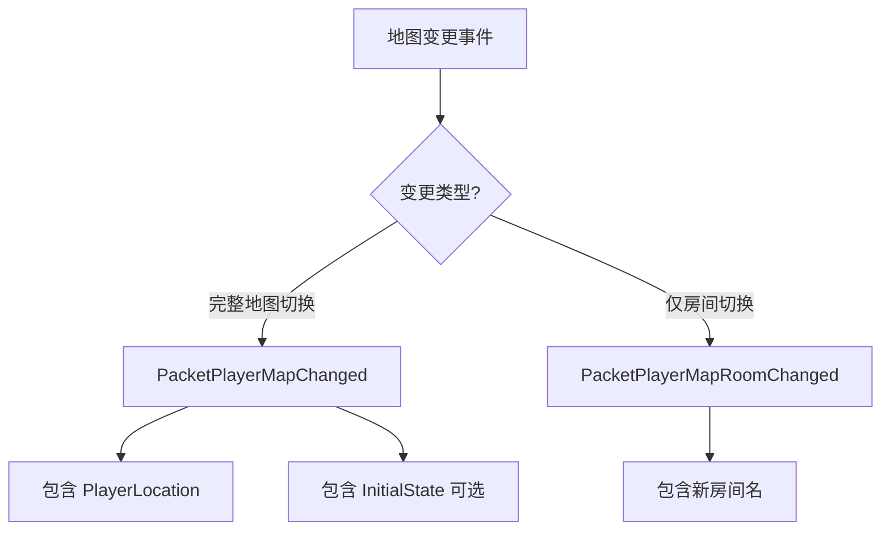

**服务器处理地图变更:**

1. 更新服务器端的玩家位置记录
2. 确定需要同步的范围:
   - 同频道 + 同地图 + 同房间 = 完整同步
   - 同频道 + 同地图 + 不同房间 = 位置同步
   - 其他 = 仅元信息同步

3. 向客户端发送同房间玩家信息:
   - `GraphicsInfo`: 图形同步信息（仅首次或更新时）
   - `PlayerState`: 位置信息、冲刺状态等

**GraphicsInfo 缓存机制:**

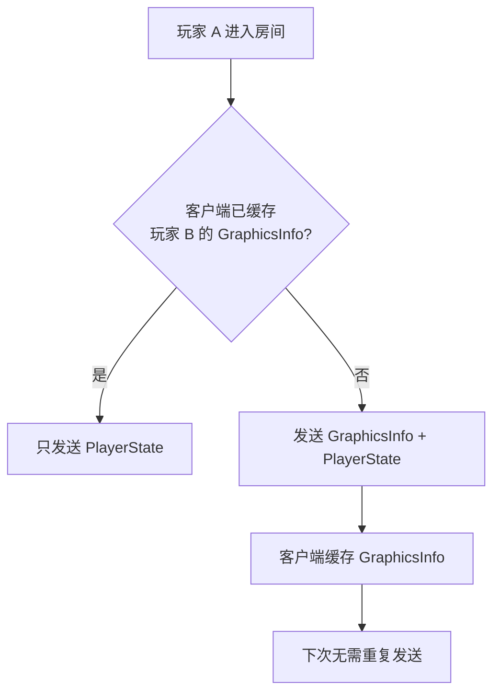

**优势:**
- 减少带宽使用
- GraphicsInfo 通常不变，缓存后可重复使用
- 除非玩家更新外观，否则不需要重新发送

#### Ghost 实体创建

客户端接收其他玩家的信息后:

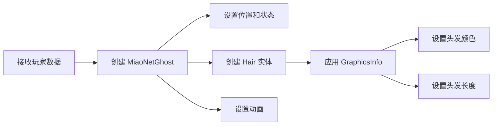

### 3. 帧同步

建立连接并进入地图后，客户端与服务器开始帧级别的实时交互:

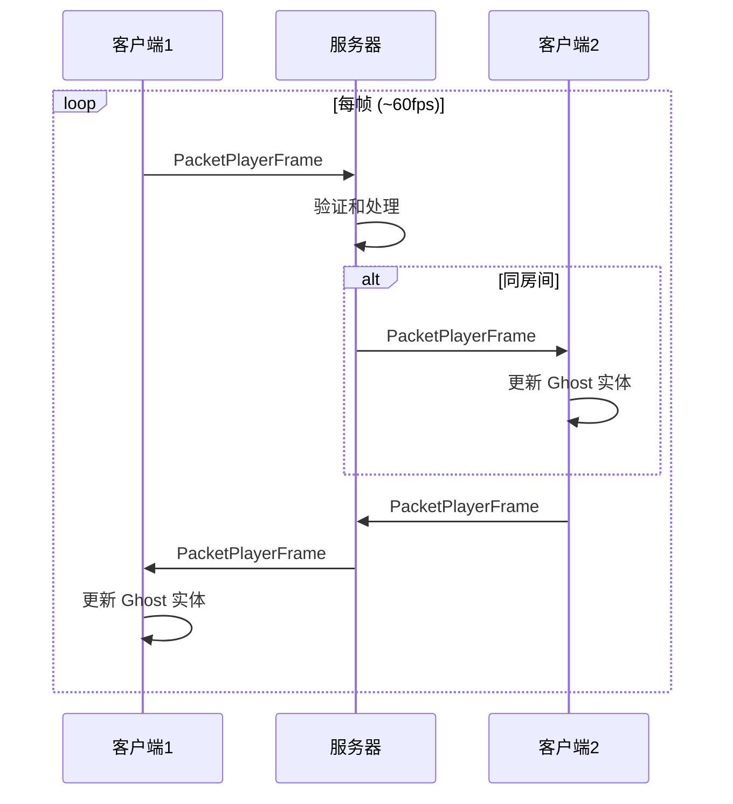

**PacketPlayerFrame 包含:**
- Position: 位置
- AnimationID: 动画 ID
- AnimationFrame: 动画帧
- Scale: 缩放
- Flags: 朝向、冲刺等标志
- Dashes: 冲刺数（条件包含）

## 连接状态机

```mermaid
stateDiagram-v2
    [*] --> Disconnected
    
    Disconnected --> Connecting: 开始连接
    Connecting --> Handshaking: TCP 连接成功
    Connecting --> Disconnected: 连接失败
    
    Handshaking --> Authenticating: 发送握手数据
    Handshaking --> Disconnected: 握手超时
    
    Authenticating --> Initializing: 验证成功
    Authenticating --> Rejected: 验证失败
    
    Initializing --> Connected: 接收初始数据
    Initializing --> Disconnected: 初始化超时
    
    Connected --> Connected: 正常通信
    Connected --> Disconnecting: 主动断开
    Connected --> Disconnected: 连接中断
    
    Rejected --> Disconnected: 显示拒绝原因
    Disconnecting --> Disconnected: 清理完成
    
    Disconnected --> [*]
```

## 同步级别 (Sync Level)

根据玩家间的位置关系，采用不同的同步策略:

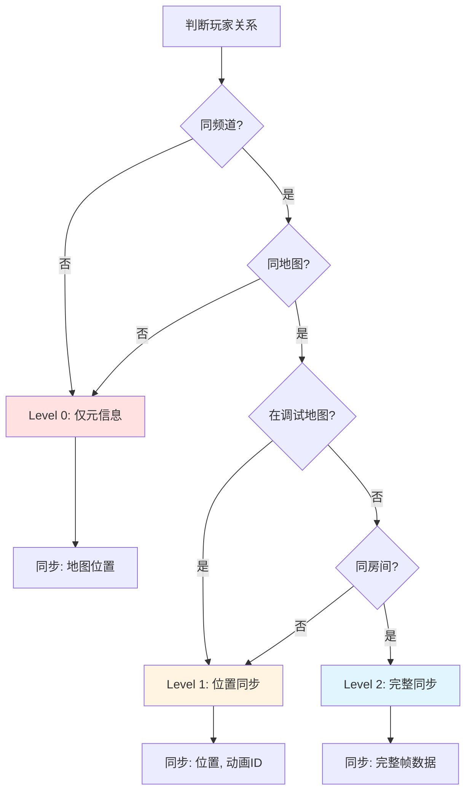

### Level 0: 元信息同步
- **条件**: 不同频道 或 不同地图
- **同步内容**:
  - 地图位置 (MapSid, MapRoom)
  - 频道信息
- **用途**: 玩家列表显示

### Level 1: 位置同步
- **条件**: 同频道 + 同地图 + (在调试地图 或 不同房间)
- **同步内容**:
  - 位置 (Position)
  - 基本动画 ID
- **用途**: 调试地图中看到其他玩家的大概位置

### Level 2: 完整同步
- **条件**: 同频道 + 同地图 + 同房间
- **同步内容**:
  - 完整的 PacketPlayerFrame (位置、动画、缩放、朝向等)
  - 状态标志 (死亡、重生等)
  - 表情
  - 聊天消息
- **用途**: 完整的多人游戏体验

## 断开连接

### 正常断开流程

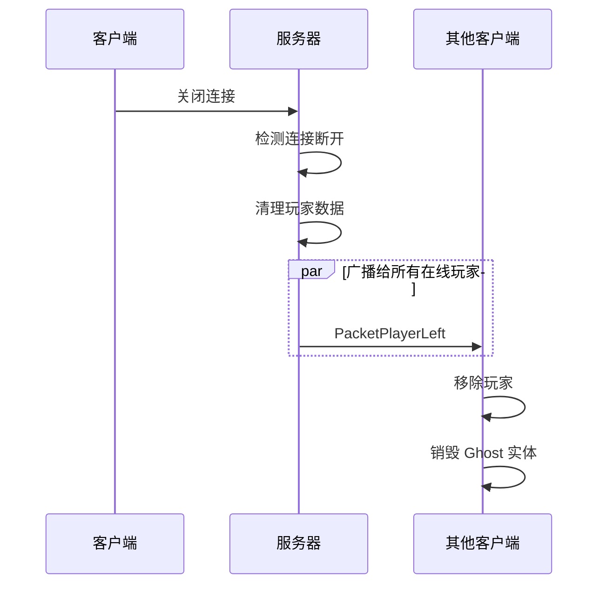

### 被踢出流程

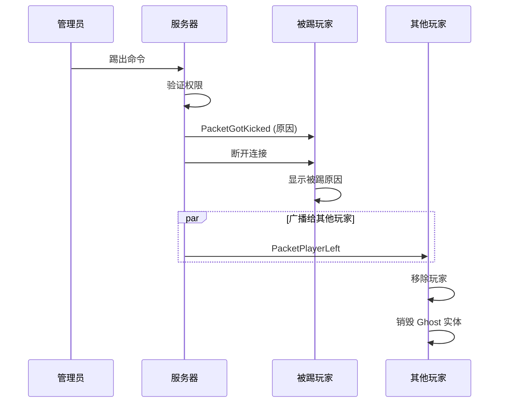

### 超时断开

服务器会检测客户端的活跃度:
- 如果长时间没有收到任何数据包
- 视为连接超时
- 自动断开连接并清理资源

## 错误处理

### 协议错误

| 错误类型 | 处理方式 |
|---------|---------|
| 版本不匹配 | 拒绝连接，返回错误信息 |
| 无效的数据包 ID | 断开连接 |
| 数据包过大 | 断开连接 |
| 反序列化失败 | 忽略数据包或断开连接 |

### 网络错误

| 错误类型 | 客户端处理 | 服务器处理 |
|---------|-----------|-----------|
| 连接超时 | 尝试重连 | 断开连接，清理资源 |
| 心跳超时 | 重新建立连接 | 断开连接 |
| TCP 错误 | 显示错误，返回主菜单 | 断开连接，广播离开消息 |

## 性能考虑

### 带宽使用

**每个玩家的带宽估算 (60fps):**
- 上行: ~1.5 KB/s (PacketPlayerFrame)
- 下行: ~1.5 KB/s × N (N = 同房间玩家数)

**100 人服务器，平均每房间 5 人:**
- 每玩家下行: ~6 KB/s
- 服务器总带宽: ~600 KB/s (上行) + ~600 KB/s (下行) ≈ 1.2 MB/s

### 延迟优化

1. **客户端预测**: 本地立即响应输入
2. **服务器权威**: 最终状态由服务器决定
3. **插值**: 平滑其他玩家的移动
4. **优先级**: 重要数据包优先发送

## 相关文档

- [通信协议 (Protocol.md)](./Protocol.md) - 详细的协议说明
- [架构设计 (Architecture.md)](./Architecture.md) - 系统架构
- [数据包参考 (PacketReference.md)](./PacketReference.md) - 所有数据包定义
