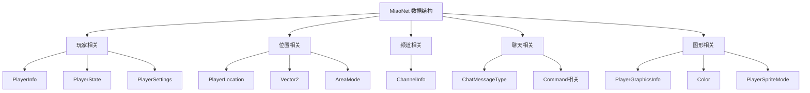
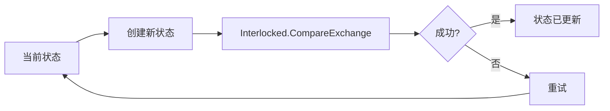
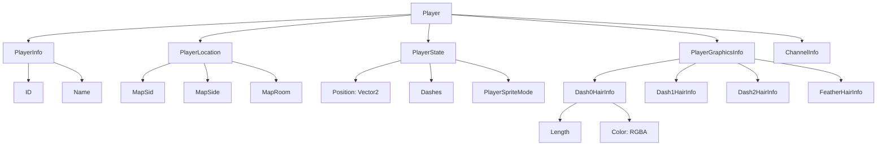
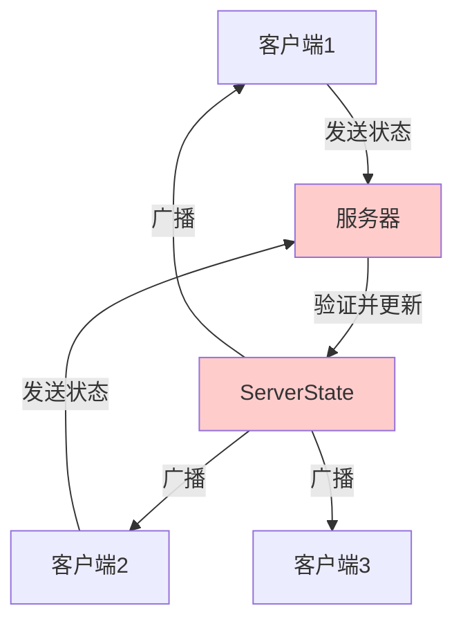

# MiaoNet 数据结构

本文档详细描述 MiaoNet 中使用的核心数据结构。

## 数据结构分类

MiaoNet 的数据结构可以分为以下几类：



## 玩家相关结构

### PlayerInfo

玩家的基本身份信息。

```csharp
public sealed class PlayerInfo : IRefBinarySerializable<PlayerInfo>
{
    public int ID { get; }        // 玩家唯一标识符
    public string Name { get; }   // 玩家昵称
}
```

**字段说明：**
- `ID`: 服务器分配的唯一玩家 ID，会话期间不变
- `Name`: 玩家的显示名称

**序列化格式：**
```
+--------+-------------+
| ID     | Name        |
| 4 字节 | 可变长度    |
| Int32  | String      |
+--------+-------------+
```

**使用场景：**
- 玩家加入/离开通知
- 聊天消息的发送者标识
- 玩家列表显示

---

### PlayerState

玩家的实时状态信息，包括位置、冲刺数等。

```csharp
public sealed class PlayerState : IRefBinarySerializable<PlayerState>
{
    public Vector2 Position { get; set; }              // 玩家位置
    public byte Dashes { get; set; }                   // 冲刺次数 (0-2)
    public bool Dashing { get; set; }                  // 是否正在冲刺 (不序列化)
    public float DeltaTime { get; set; }               // 帧间隔时间
    public PlayerSpriteMode PlayerSpriteMode { get; set; }  // 精灵模式
    public bool Dead { get; set; }                     // 是否死亡
}
```

**字段说明：**
- `Position`: 玩家在地图中的坐标（世界坐标）
- `Dashes`: 当前可用的冲刺次数（0、1、2 或更多）
- `Dashing`: 本地状态，不通过网络传输
- `DeltaTime`: 用于插值和预测的时间增量
- `PlayerSpriteMode`: 当前精灵显示模式（正常、Badeline 等）
- `Dead`: 玩家是否处于死亡状态

**序列化格式：**
```
+----------+--------+-----------+------------------+------+
| Position | Dashes | DeltaTime | PlayerSpriteMode | Dead |
| 8 字节   | 1 字节 | 4 字节    | 1 字节           | 待定 |
| Vector2  | byte   | float     | byte             |      |
+----------+--------+-----------+------------------+------+
```

**使用场景：**
- 玩家进入房间时的初始状态
- 地图切换时的状态同步
- 调试地图中的位置同步

---

### PlayerSettings

玩家的客户端设置（计划中，当前未完全实现）。

```csharp
public sealed class PlayerSettings : IRefBinarySerializable<PlayerSettings>
{
    // 计划包含：
    // - 显示设置
    // - 同步偏好
    // - 其他客户端配置
}
```

---

### PlayerGraphicsInfo

玩家的视觉外观信息，主要是头发配置。

```csharp
public sealed class PlayerGraphicsInfo : IRefBinarySerializable<PlayerGraphicsInfo>
{
    public HairInfo Dash0HairInfo;     // 0 冲刺时的头发
    public HairInfo Dash1HairInfo;     // 1 冲刺时的头发
    public HairInfo Dash2HairInfo;     // 2 冲刺时的头发
    public HairInfo FeatherHairInfo;   // 飞行状态的头发
    
    public struct HairInfo : IRefBinarySerializable<HairInfo>
    {
        public byte Length { get; set; }   // 头发长度 (节数)
        public Color Color { get; set; }   // 头发颜色
    }
}
```

**字段说明：**
- `Dash0HairInfo`: 无冲刺时的头发（蓝色）
- `Dash1HairInfo`: 1 次冲刺时的头发（红色）
- `Dash2HairInfo`: 2 次冲刺时的头发（粉色）
- `FeatherHairInfo`: 羽毛状态的头发（金色）

**默认值：**
```csharp
Default = new(
    new(4, Color(0x44, 0xB7, 0xFF)),  // 蓝色，4 节
    new(4, Color(0xAC, 0x32, 0x32)),  // 红色，4 节
    new(5, Color(0xFF, 0x6D, 0xEF)),  // 粉色，5 节
    new(7, Color(0xF2, 0xEB, 0x6D))   // 金色，7 节
);
```

**序列化格式：**
```
每个 HairInfo:
+--------+-------+
| Length | Color |
| 1 字节 | 4字节 |
| byte   | RGBA  |
+--------+-------+

完整结构: HairInfo × 4 = 20 字节
```

**优化设计：**
- 客户端缓存机制：第一次接收后本地缓存
- 除非玩家更新，否则服务器不重复发送
- 减少带宽使用

**使用场景：**
- 玩家首次加入同房间
- 玩家更新外观设置
- 新玩家需要查看已存在玩家

---

### PlayerSpriteMode

玩家精灵的显示模式枚举。

```csharp
public enum PlayerSpriteMode : byte
{
    Normal = 0,        // 正常 Madeline
    Badeline = 1,      // Badeline 形态
    // 可能的未来扩展:
    // Granny, Theo, etc.
}
```

## 位置相关结构

### PlayerLocation

玩家在游戏中的位置信息。

```csharp
public struct PlayerLocation : IRefBinarySerializable<PlayerLocation>, IEquatable<PlayerLocation>
{
    public string MapSid { get; set; }      // 地图 SID
    public AreaMode MapSide { get; set; }   // A/B/C 面
    public string MapRoom { get; set; }     // 房间名称
    
    // 辅助属性
    public readonly string MapSet { get; }         // 地图集名称
    public readonly bool IsEmpty { get; }          // 不在任何地图
    public readonly bool IsInDebugMap { get; }     // 在调试地图
    public readonly bool IsInMap { get; }          // 在普通地图
    public readonly bool IsValid { get; }          // 数据有效性
}
```

**位置状态：**

| 状态 | MapSid | MapRoom | 说明 |
|------|--------|---------|------|
| Empty | `""` | `""` | 不在地图中（主菜单等） |
| InDebugMap | 非空 | `""` | 在调试地图 |
| InMap | 非空 | 非空 | 在普通地图的某个房间 |

**示例：**
```csharp
// 在 1A 的 1-A 房间
new PlayerLocation("Celeste/1-ForsakenCity", AreaMode.Normal, "1-A")

// 在调试地图
new PlayerLocation("Celeste/1-ForsakenCity", AreaMode.Normal, "")

// 不在地图
PlayerLocation.Empty  // ("", Normal, "")
```

**序列化格式：**
```
+--------+----------+----------+
| MapSid | MapSide  | MapRoom  |
| 可变   | 1 字节   | 可变     |
| string | byte     | string   |
+--------+----------+----------+
```

**位置比较：**

```csharp
public enum ChangeResult 
{ 
    None,           // 无变化
    RoomOnly,       // 仅房间变化
    FromDebugMap,   // 从调试地图进入
    All             // 地图变化
}

public readonly ChangeResult CompareTo(PlayerLocation other);
```

**使用场景：**
- 确定同步级别（SyncLevel）
- 地图切换通知
- 玩家列表显示
- 判断是否需要同步详细状态

---

### Vector2

二维向量，用于位置、速度等。

```csharp
public struct Vector2
{
    public float X { get; set; }
    public float Y { get; set; }
}
```

**序列化格式：**
```
+------+------+
|  X   |  Y   |
| 4 B  | 4 B  |
| float| float|
+------+------+
总共 8 字节
```

---

### AreaMode

地图的难度模式（A/B/C 面）。

```csharp
public enum AreaMode : byte
{
    Normal = 0,    // A 面
    BSide = 1,     // B 面
    CSide = 2      // C 面
}
```

## 频道相关结构

### ChannelInfo

频道的基本信息。

```csharp
public struct ChannelInfo : IRefBinarySerializable<ChannelInfo>
{
    public int ID { get; }          // 频道唯一标识
    public string Name { get; set; } // 频道显示名称
}
```

**序列化格式：**
```
+------+--------+
| ID   | Name   |
| 4 B  | 可变   |
| int  | string |
+------+--------+
```

**使用场景：**
- 频道列表显示
- 频道切换
- 消息广播范围确定

## 聊天相关结构

### ChatMessageType

聊天消息类型枚举。

```csharp
public enum ChatMessageType : byte
{
    Chat,           // 普通聊天消息
    PrivateMessage, // 私聊消息
    Server,         // 服务器消息（无发送者）
    ServerChat      // 服务器聊天（有发送者字段）
}
```

**类型说明：**

| 类型 | 有发送者 | 使用场景 |
|------|---------|---------|
| Chat | 是 | 频道内公共聊天 |
| PrivateMessage | 是 | 玩家间私聊 |
| Server | 否 | 系统通知、公告 |
| ServerChat | 是 | 服务器代表某玩家发言 |

---

### CommandSegment

命令参数片段。

```csharp
public struct CommandSegment
{
    public CommandSegmentType Type { get; set; }  // 参数类型
    public string Value { get; set; }             // 参数值
}

public enum CommandSegmentType
{
    Text,      // 普通文本
    Player,    // 玩家引用
    Channel,   // 频道引用
    // 可扩展其他类型
}
```

**使用场景：**
- 命令参数解析
- 自动补全
- 参数验证

## 图形相关结构

### Color

RGBA 颜色结构。

```csharp
public struct Color
{
    public byte R { get; set; }  // 红色分量 (0-255)
    public byte G { get; set; }  // 绿色分量 (0-255)
    public byte B { get; set; }  // 蓝色分量 (0-255)
    public byte A { get; set; }  // 透明度 (0-255)
    
    public Color(byte r, byte g, byte b, byte a = 255);
}
```

**序列化格式：**
```
+---+---+---+---+
| R | G | B | A |
| 1B| 1B| 1B| 1B|
+---+---+---+---+
总共 4 字节
```

---

### KnownPlayerAnimations

已知的玩家动画 ID 常量（部分）。

```csharp
public static class KnownPlayerAnimations
{
    public const ushort Idle = 0;
    public const ushort Walk = 1;
    public const ushort Run = 2;
    public const ushort Dash = 3;
    public const ushort Jump = 4;
    public const ushort Fall = 5;
    public const ushort Climb = 6;
    // ... 更多动画
}
```

**用途：**
- 客户端动画状态管理
- 服务器动画验证
- 调试和日志记录

## 表情相关结构

### EmoteData

表情数据。

```csharp
public struct EmoteData
{
    public string ID { get; set; }               // 表情唯一标识
    public EmoteAtlasCategory Category { get; set; }  // 所属图集类别
    // 其他表情相关数据
}

public enum EmoteAtlasCategory
{
    Gameplay,   // 游戏内表情
    // 可扩展更多类别
}
```

## 服务器特有结构

### ServerPlayer

服务器端的玩家表示（包含更多内部状态）。

```csharp
public sealed class ServerPlayer
{
    public int ID { get; }
    public string Name { get; }
    public int ChannelID { get; set; }
    public PlayerLocation Location { get; set; }
    public PlayerState State { get; set; }
    public PlayerGraphicsInfo GraphicsInfo { get; set; }
    
    // 服务器内部状态
    public MiaoClientConnection Connection { get; }
    public DateTime LastUpdate { get; set; }
    public bool IsTimeout { get; }
    // ... 更多内部字段
}
```

---

### ServerChannel

服务器端的频道表示。

```csharp
public sealed class ServerChannel
{
    public int ID { get; }
    public string Name { get; }
    public ImmutableList<ServerPlayer> Players { get; }
    
    // 频道管理方法
    public ServerChannel AddPlayer(ServerPlayer player);
    public ServerChannel RemovePlayer(ServerPlayer player);
}
```

**不可变设计：**
- `ServerChannel` 对象不可变
- 修改操作返回新的 `ServerChannel` 实例
- 通过原子操作更新引用

**示例代码：**
```csharp
// 原子更新示例
ServerChannel oldChannel = currentChannel;
ServerChannel newChannel = oldChannel.AddPlayer(newPlayer);

// 使用 Interlocked.CompareExchange 确保原子性
ServerChannel result = Interlocked.CompareExchange(
    ref currentChannel,
    newChannel,    // 新值
    oldChannel     // 期望的旧值
);

// 如果 result == oldChannel，更新成功
// 否则需要重试（其他线程已修改）
```

---

### ServerState

全局服务器状态。

```csharp
public sealed class ServerState
{
    public ImmutableList<ServerChannel> Channels { get; }
    public ImmutableDictionary<int, ServerPlayer> Players { get; }
    
    // 状态更新方法（返回新状态）
    public ServerState AddPlayer(ServerPlayer player);
    public ServerState RemovePlayer(int playerID);
    public ServerState UpdateChannel(ServerChannel channel);
}
```

**不可变状态管理：**



## 客户端特有结构

### OnlinePlayer

客户端的在线玩家表示。

```csharp
public sealed class OnlinePlayer
{
    public int ID { get; }
    public string Name { get; }
    public int ChannelID { get; set; }
    public PlayerLocation Location { get; set; }
    public PlayerState? State { get; set; }
    public PlayerGraphicsInfo? GraphicsInfo { get; set; }
    
    // 客户端特有
    public MiaoNetGhost? Ghost { get; set; }  // 对应的游戏实体
}
```

---

### OnlineChannel

客户端的频道表示。

```csharp
public sealed class OnlineChannel
{
    public int ID { get; }
    public string Name { get; }
    public List<OnlinePlayer> Players { get; }
}
```

---

### MiaoNetGhost

游戏中其他玩家的实体。

```csharp
public class MiaoNetGhost : Actor
{
    public OnlinePlayer Player { get; }
    public PlayerSprite Sprite { get; }
    public Hair Hair { get; }
    
    // 实体更新逻辑
    public void UpdateFromFrame(PacketPlayerFrame frame);
    public void UpdateFromState(PlayerState state);
}
```

## 数据关系图

### 玩家数据完整视图



## 数据一致性

### 服务器权威

服务器是所有玩家状态的权威来源：



### 客户端预测

客户端可以进行本地预测，但最终以服务器为准：

1. 客户端发送输入
2. 客户端本地预测结果
3. 服务器计算权威状态
4. 客户端接收服务器状态
5. 必要时进行状态校正

## 版本兼容性

### Version 结构

```csharp
public class Version
{
    public ushort Major { get; }
    public ushort Minor { get; }
    public ushort Build { get; }
}
```

**序列化格式：**
```
+-------+-------+-------+
| Major | Minor | Build |
| 2 B   | 2 B   | 2 B   |
+-------+-------+-------+
总共 6 字节
```

**兼容性规则：**
- `Major` 不同：不兼容
- `Minor` 不同：可能兼容（根据特性）
- `Build` 不同：完全兼容

## 数据验证

### 范围约束

| 字段 | 类型 | 有效范围 | 说明 |
|------|------|---------|------|
| Dashes | byte | 0-255 | 通常 0-2，支持扩展 |
| AnimationID | ushort | 0-65535 | 动画类型 |
| AnimationFrame | ushort | 0-65535 | 动画帧 |
| HairLength | byte | 0-255 | 通常 4-7 |
| PlayerID | int | 1-N | 0 保留 |
| ChannelID | int | 0-N | 0 为默认频道 |

### 空值处理

某些字段可为 `null`，表示该数据不可用或不需要：
- `PlayerGraphicsInfo?`: 未接收到图形信息
- `PlayerState?`: 玩家不在地图中
- `int? SourcePlayer`: 服务器消息无发送者

## 相关文档

- [架构设计 (Architecture.md)](./Architecture.md) - 系统架构
- [通信协议 (Protocol.md)](./Protocol.md) - 协议详解
- [数据包参考 (PacketReference.md)](./PacketReference.md) - 数据包列表
