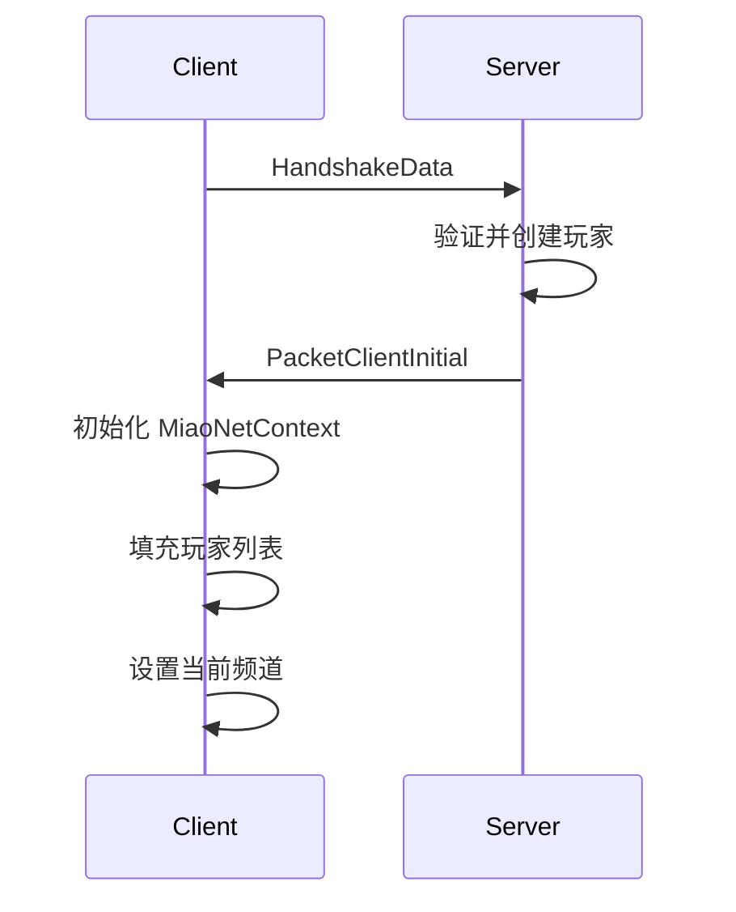
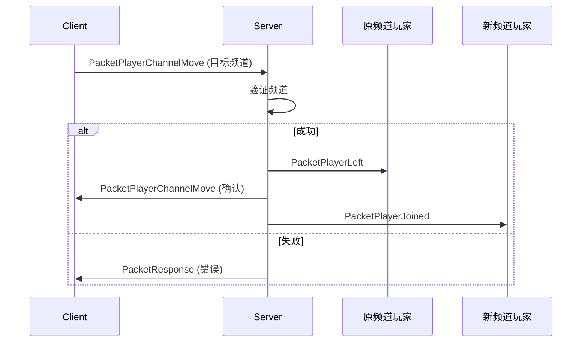
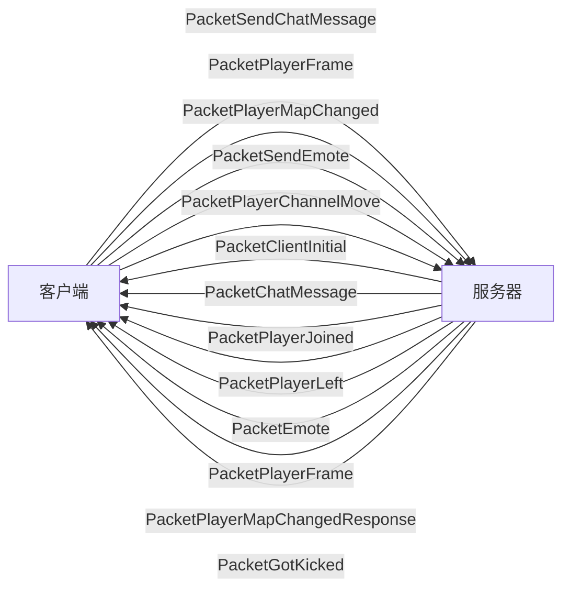

# MiaoNet 数据包参考

本文档提供所有 MiaoNet 数据包类型的完整参考。

## 数据包分类

```mermaid
graph TB
    PKT[数据包] --> CONN[连接相关]
    PKT --> PLAYER[玩家相关]
    PKT --> CHAT[聊天相关]
    PKT --> SYS[系统相关]
    
    CONN --> CONN1[PacketClientInitial]
    CONN --> CONN2[PacketGotKicked]
    
    PLAYER --> PLAYER1[玩家加入/离开]
    PLAYER --> PLAYER2[状态同步]
    PLAYER --> PLAYER3[位置同步]
    PLAYER --> PLAYER4[表情系统]
    
    PLAYER1 --> P1[PacketPlayerJoined]
    PLAYER1 --> P2[PacketPlayerLeft]
    
    PLAYER2 --> P3[PacketPlayerFrame]
    PLAYER2 --> P4[PacketPlayerStateFlags]
    PLAYER2 --> P5[PacketPlayerGraphicsUpdate]
    
    PLAYER3 --> P6[PacketPlayerMapChanged]
    PLAYER3 --> P7[PacketPlayerMapChangedResponse]
    PLAYER3 --> P8[PacketPlayerMapRoomChanged]
    PLAYER3 --> P9[PacketPlayerChannelMove]
    
    PLAYER4 --> P10[PacketEmote]
    PLAYER4 --> P11[PacketEmoteText]
    PLAYER4 --> P12[PacketSendEmote]
    PLAYER4 --> P13[PacketSendEmoteText]
    
    CHAT --> C1[PacketChatMessage]
    CHAT --> C2[PacketSendChatMessage]
    CHAT --> C3[PacketChatCommand]
    
    SYS --> S1[PacketRequest]
    SYS --> S2[PacketResponse]
    SYS --> S3[PacketPlayerNotification]
```



## 数据包索引

### 连接与初始化

- [PacketClientInitial](#packetclientinitial) - 客户端初始化数据
- [PacketGotKicked](#packetgotkicked) - 被踢出通知

### 玩家加入/离开

- [PacketPlayerJoined](#packetplayerjoined) - 玩家加入通知
- [PacketPlayerLeft](#packetplayerleft) - 玩家离开通知

### 玩家状态同步

- [PacketPlayerFrame](#packetplayerframe) - 玩家帧数据
- [PacketPlayerStateFlags](#packetplayerstateflags) - 玩家状态标志
- [PacketPlayerGraphicsUpdate](#packetplayergraphicsupdate) - 玩家外观更新

### 位置与地图

- [PacketPlayerMapChanged](#packetplayermapchanged) - 地图变更通知
- [PacketPlayerMapChangedResponse](#packetplayermapchangedresponse) - 地图变更响应
- [PacketPlayerMapRoomChanged](#packetplayermaproomchanged) - 房间变更通知
- [PacketPlayerChannelMove](#packetplayerchannelmove) - 频道切换

### 表情系统

- [PacketEmote](#packetemote) - 表情通知
- [PacketEmoteText](#packetemotetext) - 文字表情通知
- [PacketSendEmote](#packetsendemote) - 发送表情
- [PacketSendEmoteText](#packetsendemotetext) - 发送文字表情

### 聊天系统

- [PacketChatMessage](#packetchatmessage) - 聊天消息
- [PacketSendChatMessage](#packetsendchatmessage) - 发送聊天消息
- [PacketChatCommand](#packetchatcommand) - 聊天命令

### 通用框架

- [PacketRequest](#packetrequest) - 请求基类
- [PacketResponse](#packetresponse) - 响应基类
- [PacketPlayerNotification](#packetplayernotification) - 玩家通知基类

---

## 连接与初始化

### PacketClientInitial

**方向**: 服务器 → 客户端  
**时机**: 握手成功后立即发送  
**用途**: 向客户端提供初始化所需的所有数据

**结构**:
```csharp
public sealed class PacketClientInitial : IPacket<PacketClientInitial>
{
    public PlayerInfo SelfPlayerInfo { get; }              // 自己的玩家信息
    public IReadOnlyCollection<ChannelInfo> Channels { get; }  // 频道列表
    public IReadOnlyCollection<Player> Players { get; }    // 当前在线玩家列表
    
    public struct Player
    {
        public int ChannelID { get; }                 // 所在频道
        public PlayerInfo PlayerInfo { get; }         // 玩家基本信息
        public PlayerLocation Location { get; }       // 位置信息
        public PlayerGraphicsInfo? GraphicsInfo { get; }  // 图形信息（可选）
        public PlayerState? State { get; }            // 状态信息（可选）
    }
}
```

**序列化格式**:
```
+----------------+------------------+------------------+
| SelfPlayerInfo | Channels (Array) | Players (Array)  |
+----------------+------------------+------------------+
```

**Player 序列化**:
```
+--------+-------------+------------+----------+--------------------+-------+
| Flags  | GraphicsInfo| State      |ChannelID | PlayerInfo         |Location|
| 1 byte | (条件)      | (条件)     | 4 bytes  | (PlayerInfo 格式)  |(Loc格式)|
+--------+-------------+------------+----------+--------------------+-------+

Flags:
  Bit 0: HasGraphicsInfo
  Bit 1: HasState
```

**使用场景**:
1. 客户端连接成功后
2. 初始化玩家列表
3. 初始化频道列表
4. 缓存已知玩家的图形信息

**流程**:


---

### PacketGotKicked

**方向**: 服务器 → 客户端  
**时机**: 玩家被踢出时  
**用途**: 通知客户端被踢出的原因

**结构**:
```csharp
public sealed class PacketGotKicked : IPacket<PacketGotKicked>
{
    // 当前未完全实现
}

public enum KickedReason : byte
{
    Manually,              // 手动踢出
    InvalidPacket,         // 无效的数据包
    InvalidPacketWithState // 带状态的无效数据包
}
```

**状态**: 🚧 部分实现

---

## 玩家加入/离开

### PacketPlayerJoined

**方向**: 服务器 → 客户端  
**时机**: 新玩家加入服务器时  
**用途**: 通知所有客户端有新玩家加入

**结构**:
```csharp
public sealed class PacketPlayerJoined : IPacket<PacketPlayerJoined>
{
    public int ChannelID { get; }      // 玩家所在频道
    public PlayerInfo PlayerInfo { get; }  // 玩家信息
}
```

**序列化格式**:
```
+-----------+-------------+
| ChannelID | PlayerInfo  |
| 4 bytes   | (Info格式)  |
+-----------+-------------+
```

**接收处理**:
1. 将玩家添加到在线玩家列表
2. 如果在同频道，更新玩家列表 UI
3. 可选：显示 "XXX 加入了游戏" 消息

---

### PacketPlayerLeft

**方向**: 服务器 → 客户端  
**时机**: 玩家离开服务器时  
**用途**: 通知所有客户端有玩家离开

**结构**:
```csharp
public sealed class PacketPlayerLeft : PacketPlayerNotification, IPacket<PacketPlayerLeft>
{
    public int PlayerID { get; }    // 离开的玩家 ID
    
    public enum LeftReason
    {
        Manually,      // 主动断开
        Inactive,      // 超时无响应
        Interrupted    // 连接中断
    }
    
    public LeftReason Reason { get; set; }  // 离开原因
}
```

**序列化格式**:
```
+----------+
| PlayerID |
| 4 bytes  |
+----------+
注: Reason 当前未序列化
```

**接收处理**:
1. 从在线玩家列表移除玩家
2. 销毁对应的 Ghost 实体（如果存在）
3. 更新玩家列表 UI
4. 可选：显示 "XXX 离开了游戏" 消息

---

## 玩家状态同步

### PacketPlayerFrame

**方向**: 双向（主要是客户端 → 服务器 → 其他客户端）  
**频率**: ~60 次/秒  
**用途**: 实时同步玩家的位置、动画和状态

**结构**:
```csharp
public sealed class PacketPlayerFrame : IPacket<PacketPlayerFrame>
{
    public Vector2 Position { get; }         // 玩家位置 (8 bytes)
    public ushort AnimationID { get; }       // 动画 ID (2 bytes)
    public ushort AnimationFrame { get; }    // 动画帧 (2 bytes)
    public Vector2 Scale { get; }            // 缩放 (8 bytes)
    public FrameFlags Flags { get; }         // 标志位 (2 bytes)
    public byte Dashes { get; set; }         // 冲刺数 (1 byte, 条件)
    
    [Flags]
    public enum FrameFlags : ushort
    {
        FacingLeft = 1 << 0,    // 朝向左
        StartDash = 1 << 1,     // 开始冲刺
        EndDash = 1 << 2,       // 结束冲刺
        DashesChange = 1 << 3   // 冲刺数改变
    }
}
```

**序列化格式**:
```
+----------+-------+----------+-------+-------+--------+
| Position | AniID | AniFrame | Scale | Flags | Dashes |
| 8 bytes  | 2 B   | 2 B      | 8 B   | 2 B   | 1 B    |
+----------+-------+----------+-------+-------+--------+
总大小: 22-23 字节 (Dashes 条件包含)
```

**优化点**:
- 只在 `DashesChange` 标志为 true 时才包含 `Dashes` 字段
- 使用 `FrameFlags` 打包多个布尔值
- 总大小约 26 字节，适合高频传输

**发送时机** (客户端):
- 每帧更新（如果状态有显著变化）
- 可以跳帧以节省带宽

**接收处理** (客户端):
1. 查找对应的 `MiaoNetGhost` 实体
2. 更新实体位置和动画
3. 处理冲刺状态变化
4. 插值以平滑显示

**SyncLevel**:
- Level 2 (完整同步): 发送所有字段
- Level 1 (位置同步): 仅发送位置和基本信息
- Level 0 (无同步): 不发送此包

---

### PacketPlayerStateFlags

**方向**: 客户端 → 服务器 → 其他客户端  
**频率**: 按需  
**用途**: 同步不那么时间敏感的状态标志

**结构**:
```csharp
public sealed class PacketPlayerStateFlags : IPacket<PacketPlayerStateFlags>
{
    [Flags]
    public enum StateFlags : ushort
    {
        PlayerDied = 1 << 0,        // 玩家死亡
        PlayerRespawning = 1 << 1   // 玩家重生中
        // 可扩展更多标志
    }
    
    public StateFlags Flags { get; }
}
```

**序列化格式**:
```
+-------+
| Flags |
| 2 B   |
+-------+
```

**使用场景**:
- 玩家死亡
- 玩家重生
- 未来可能：头发被吹动、精灵模式变化等

---

### PacketPlayerGraphicsUpdate

**方向**: 客户端 → 服务器 → 其他客户端  
**频率**: 按需（玩家更改外观时）  
**用途**: 更新玩家的外观信息

**结构**:
```csharp
public sealed class PacketPlayerGraphicsUpdate : IPacket<PacketPlayerGraphicsUpdate>
{
    public enum UpdateFlags : byte
    {
        HairDash0,      // 更新 0 冲刺头发
        HairDash1,      // 更新 1 冲刺头发
        HairDash2,      // 更新 2 冲刺头发
        HairFeather,    // 更新飞行头发
        SpriteMode      // 更新精灵模式
    }
    
    // 实现细节待定
}
```

**状态**: 🚧 未完全实现

---

## 位置与地图

### PacketPlayerMapChanged

**方向**: 客户端 → 服务器  
**时机**: 玩家切换地图或进入/离开调试地图时  
**用途**: 通知服务器玩家的位置变化

**结构**:
```csharp
public sealed class PacketPlayerMapChanged : IPacket<PacketPlayerMapChanged>
{
    public PlayerLocation Location { get; set; }    // 新位置
    public PlayerState? InitialState { get; }       // 初始状态（可选）
}
```

**序列化格式**:
```
+----------+----------+---------------+
| Location | HasState | InitialState  |
| (Loc格式)| 1 byte   | (State格式)   |
+----------+----------+---------------+
```

**位置类型**:
- `InMap`: MapSid ≠ "", MapRoom ≠ "" - 在普通地图的房间中
- `InDebugMap`: MapSid ≠ "", MapRoom = "" - 在调试地图
- `None`: MapSid = "", MapRoom = "" - 不在地图（主菜单等）

**发送时机**:
- 进入新地图
- 离开地图
- 进入/离开调试地图

---

### PacketPlayerMapChangedResponse

**方向**: 服务器 → 客户端  
**时机**: 服务器处理 `PacketPlayerMapChanged` 后  
**用途**: 向客户端发送同房间的其他玩家信息

**结构**:
```csharp
public sealed class PacketPlayerMapChangedResponse : IPacket<PacketPlayerMapChangedResponse>
{
    public struct Player : IRefBinarySerializable<Player>
    {
        public int PlayerID { get; }              // 玩家 ID
        public PlayerState State { get; }         // 玩家状态
        public PlayerGraphicsInfo? GraphicsInfo { get; }  // 图形信息（可选）
    }
    
    public IReadOnlyCollection<Player> Players { get; }
}
```

**序列化格式**:
```
+------------------+
| Players (Array)  |
+------------------+

每个 Player:
+----------+-------+----------------+
| PlayerID | State | GraphicsInfo   |
| 4 bytes  |(State)| (条件包含)     |
+----------+-------+----------------+
```

**服务器逻辑**:
1. 确定同房间的其他玩家
2. 对于每个玩家：
   - 必定包含 `PlayerState`
   - 如果客户端未缓存，包含 `PlayerGraphicsInfo`
3. 发送响应

**客户端处理**:
1. 接收玩家列表
2. 为每个玩家创建 `MiaoNetGhost` 实体
3. 缓存新的 `PlayerGraphicsInfo`

---

### PacketPlayerMapRoomChanged

**方向**: 客户端 → 服务器 → 其他客户端  
**时机**: 玩家在同一地图内切换房间时  
**用途**: 快速通知房间变化，无需完整的地图变更流程

**结构**:
```csharp
public sealed class PacketPlayerMapRoomChanged : IPacket<PacketPlayerMapRoomChanged>
{
    public string MapRoom { get; }  // 新房间名称
}
```

**序列化格式**:
```
+----------+
| MapRoom  |
| (string) |
+----------+
```

**注意**:
- 仅用于房间变化（MapRoom 变化）
- 不用于进入/离开调试地图（应使用 `PacketPlayerMapChanged`）
- 地图切换也使用 `PacketPlayerMapChanged`

---

### PacketPlayerChannelMove

**方向**: 双向  
**时机**: 玩家切换频道时  
**用途**: 请求/通知频道切换

**结构**:
```csharp
public sealed class PacketPlayerChannelMove : IPacket<PacketPlayerChannelMove>
{
    public int ChannelID { get; }  // 目标频道 ID
}
```

**序列化格式**:
```
+-----------+
| ChannelID |
| 4 bytes   |
+-----------+
```

**流程**:


---

## 表情系统

### PacketEmote

**方向**: 服务器 → 客户端 (广播)  
**时机**: 玩家发送表情后  
**用途**: 显示玩家的表情气泡

**结构**:
```csharp
public sealed class PacketEmote : PacketPlayerNotification, IPacket<PacketEmote>
{
    public int PlayerID { get; }    // 发送者
    public EmoteData Emote { get; }  // 表情数据
}
```

**序列化格式**:
```
+----------+-------+
| PlayerID | Emote |
| 4 bytes  |(Emote)|
+----------+-------+
```

**接收处理**:
1. 查找玩家的 Ghost 实体
2. 在玩家上方创建表情气泡
3. 播放表情动画

---

### PacketSendEmote

**方向**: 客户端 → 服务器  
**时机**: 玩家发送表情时  
**用途**: 请求发送表情

**结构**:
```csharp
public sealed class PacketSendEmote : IPacket<PacketSendEmote>
{
    public EmoteData Emote { get; }  // 要发送的表情
}
```

**服务器处理**:
1. 验证表情 ID 是否有效
2. 广播 `PacketEmote` 给同房间玩家

---

### PacketEmoteText

**方向**: 服务器 → 客户端 (广播)  
**时机**: 玩家发送文字表情后  
**用途**: 显示玩家的文字气泡

**结构**:
```csharp
public sealed class PacketEmoteText : PacketPlayerNotification, IPacket<PacketEmoteText>
{
    public int PlayerID { get; }  // 发送者
    public string Text { get; }   // 文字内容
}
```

**限制**:
- 文字长度限制（具体值待定）
- 可能的内容过滤

---

### PacketSendEmoteText

**方向**: 客户端 → 服务器  
**时机**: 玩家发送文字表情时  
**用途**: 请求发送文字表情

**结构**:
```csharp
public sealed class PacketSendEmoteText : IPacket<PacketSendEmoteText>
{
    public string Text { get; }  // 要发送的文字
}
```

---

## 聊天系统

### PacketChatMessage

**方向**: 服务器 → 客户端  
**时机**: 有聊天消息时  
**用途**: 传递聊天消息

**结构**:
```csharp
public sealed class PacketChatMessage : IPacket<PacketChatMessage>
{
    public ChatMessageType Type { get; set; }     // 消息类型
    public int? SourcePlayer { get; set; }        // 发送者 ID（可选）
    public string Content { get; set; }           // 消息内容
}

public enum ChatMessageType : byte
{
    Chat,           // 普通聊天
    PrivateMessage, // 私聊
    Server,         // 服务器消息
    ServerChat      // 服务器聊天
}
```

**序列化格式**:
```
+------+-----------+--------------+---------+
| Type | HasPlayer | SourcePlayer | Content |
| 1 B  | 1 B       | 4 B (条件)   | string  |
+------+-----------+--------------+---------+
```

**消息类型说明**:

| 类型 | SourcePlayer | 颜色 | 用途 |
|------|--------------|------|------|
| Chat | 必需 | 默认 | 频道聊天 |
| PrivateMessage | 必需 | 特殊色 | 私聊 |
| Server | null | 系统色 | 系统消息 |
| ServerChat | 可选 | 默认 | 服务器代发 |

**客户端处理**:
1. 根据类型选择显示样式
2. 查找发送者名称（如果有）
3. 添加到聊天历史
4. 显示在聊天框

---

### PacketSendChatMessage

**方向**: 客户端 → 服务器  
**时机**: 玩家发送聊天消息时  
**用途**: 发送聊天消息

**结构**:
```csharp
public sealed class PacketSendChatMessage : IPacket<PacketSendChatMessage>
{
    public string Content { get; }  // 消息内容
}
```

**服务器处理**:
1. 检查内容是否为命令（以 `/` 开头）
2. 如果是命令，解析并执行
3. 如果是聊天，广播给同频道玩家
4. 可能的过滤和验证

---

### PacketChatCommand

**方向**: 客户端 → 服务器  
**时机**: 玩家执行命令时  
**用途**: 执行游戏内命令

**结构**:
```csharp
public sealed class PacketChatCommand : IPacket<PacketChatCommand>
{
    public string Command { get; }                        // 命令名
    public IReadOnlyList<CommandSegment> Args { get; }    // 参数列表
}
```

**状态**: 🚧 部分实现

---

## 通用框架

### PacketRequest

**用途**: 请求-响应模式的基类

**结构**:
```csharp
public abstract class PacketRequest<TResponse> : IPacket
    where TResponse : PacketResponse
{
    public int RequestID { get; set; }  // 请求 ID，用于匹配响应
}
```

**使用**:
- 子类继承此类
- 发送请求时分配唯一的 RequestID
- 等待对应 RequestID 的响应

---

### PacketResponse

**用途**: 响应的基类

**结构**:
```csharp
public abstract class PacketResponse : IPacket
{
    public int RequestID { get; set; }  // 对应的请求 ID
    
    public PacketResponse(int requestID)
    {
        RequestID = requestID;
    }
}
```

**使用**:
- 子类继承此类
- ResponseID 匹配原始请求的 RequestID
- 客户端根据 RequestID 路由到正确的回调

---

### PacketPlayerNotification

**用途**: 带玩家 ID 的通知基类

**结构**:
```csharp
public abstract class PacketPlayerNotification
{
    public int PlayerID { get; }  // 相关的玩家 ID
    
    public virtual void Serialize(ref RefBinaryWriter writer)
        => writer.Write(PlayerID);
}
```

**继承者**:
- `PacketPlayerLeft`
- `PacketEmote`
- `PacketEmoteText`

**泛型版本**:
```csharp
public sealed class PacketPlayerNotification<TPacket> : IPacket<PacketPlayerNotification<TPacket>>
    where TPacket : IPacket<TPacket>
{
    public int PlayerID { get; }
    public TPacket Packet { get; }
}
```

用于包装任意数据包并附加玩家 ID。

---

## 数据包大小统计

| 数据包 | 最小大小 | 最大大小 | 平均大小 |
|--------|---------|---------|---------|
| PacketPlayerFrame | 22 B | 23 B | ~22 B |
| PacketChatMessage | ~10 B | ~500 B | ~50 B |
| PacketPlayerJoined | ~15 B | ~50 B | ~30 B |
| PacketPlayerLeft | 4 B | 4 B | 4 B |
| PacketEmote | ~20 B | ~50 B | ~30 B |
| PacketPlayerMapChanged | ~20 B | ~100 B | ~40 B |
| PacketClientInitial | 100 B | 10 KB+ | ~2 KB |

## 数据包流向图



## 实现状态

| 状态 | 说明 |
|------|------|
| ✅ | 完全实现并在使用 |
| 🚧 | 部分实现或待完善 |
| ❌ | 未实现 |

| 数据包 | 状态 |
|--------|------|
| PacketClientInitial | ✅ |
| PacketPlayerJoined | ✅ |
| PacketPlayerLeft | ✅ |
| PacketPlayerFrame | ✅ |
| PacketChatMessage | ✅ |
| PacketSendChatMessage | ✅ |
| PacketEmote | ✅ |
| PacketSendEmote | ✅ |
| PacketEmoteText | ✅ |
| PacketSendEmoteText | ✅ |
| PacketPlayerMapChanged | ✅ |
| PacketPlayerMapChangedResponse | ✅ |
| PacketPlayerMapRoomChanged | ✅ |
| PacketPlayerChannelMove | ✅ |
| PacketPlayerStateFlags | ✅ |
| PacketPlayerGraphicsUpdate | 🚧 |
| PacketGotKicked | 🚧 |
| PacketChatCommand | 🚧 |
| PacketRequest/Response | 🚧 |

## 相关文档

- [架构设计 (Architecture.md)](./Architecture.md) - 系统架构
- [通信协议 (Protocol.md)](./Protocol.md) - 协议详解
- [数据结构 (DataStructures.md)](./DataStructures.md) - 数据结构参考
