# MiaoNet 通信协议

本文档详细描述 MiaoNet 客户端与服务器之间的通信协议、数据格式和传输机制。

## 协议概览

MiaoNet 使用基于 TCP 的自定义二进制协议进行通信。协议设计目标：
- **高效**: 紧凑的二进制格式，最小化带宽使用
- **可靠**: 基于 TCP 保证数据可靠传输
- **可扩展**: 支持未来的协议扩展和新功能

### 协议栈

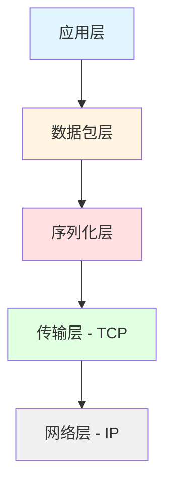

## 数据包格式

### 基本结构

每个数据包都遵循以下格式：

```
+----------------+----------------+------------------+
|  Size (2 byte) | Packet ID (2B) |  Payload (N B)   |
+----------------+----------------+------------------+
|    UInt16      |    UInt16      |   Variable       |
|  Little Endian | Little Endian  |                  |
+----------------+----------------+------------------+
```

**字段说明：**

1. **Size** (2 字节, UInt16): 
   - 表示后续数据的长度（Packet ID + Payload）
   - 不包括 Size 字段本身
   - 最大值 65535，意味着单个数据包最大约 64KB

2. **Packet ID** (2 字节, UInt16):
   - 数据包类型的唯一标识符
   - 通过 `PacketRegistry` 自动分配
   - ID 0 保留未使用
   - ID 从 1 开始按注册顺序递增

3. **Payload** (可变长度):
   - 数据包的实际内容
   - 使用 `RefBinaryWriter` 序列化
   - 格式取决于具体的数据包类型

### 数据包生命周期


## 序列化机制

### IRefBinarySerializable 接口

所有可序列化的类型都实现此接口：

```csharp
public interface IRefBinarySerializable
{
}

public interface IRefBinarySerializable<T> : IRefBinarySerializable 
    where T : IRefBinarySerializable<T>
{
    void Serialize(ref RefBinaryWriter writer);
    static abstract T Deserialize(ref RefBinaryReader reader);
}
```

### RefBinaryWriter 和 RefBinaryReader

使用 `ref struct` 实现的高性能序列化器：

**优势：**
- 零堆分配（在栈上分配）
- 使用 `Span<byte>` 进行高效内存操作
- Little Endian 字节序，保证跨平台一致性

**支持的基本类型：**

| C# 类型 | 大小 | 序列化方法 |
|---------|------|------------|
| `byte` | 1 字节 | `Write(byte)` |
| `bool` | 1 字节 | `Write(bool)` |
| `short` / `Int16` | 2 字节 | `Write(Int16)` |
| `ushort` / `UInt16` | 2 字节 | `Write(UInt16)` |
| `int` / `Int32` | 4 字节 | `Write(Int32)` |
| `uint` / `UInt32` | 4 字节 | `Write(UInt32)` |
| `long` / `Int64` | 8 字节 | `Write(Int64)` |
| `ulong` / `UInt64` | 8 字节 | `Write(UInt64)` |
| `float` / `Single` | 4 字节 | `Write(Single)` |
| `double` / `Double` | 8 字节 | `Write(Double)` |
| `Half` | 2 字节 | `Write(Half)` |

**支持的复合类型：**

| 类型 | 格式 | 说明 |
|------|------|------|
| `string` | `UInt16 (length)` + UTF-8 bytes | 最大 65535 字节 |
| `Version` | `UInt16` (major) + `UInt16` (minor) + `UInt16` (build) | 三段版本号 |
| `Color` | 4 bytes (R, G, B, A) | RGBA 颜色 |
| `Vector2` | `Single` (X) + `Single` (Y) | 2D 向量 |
| `Array<T>` | `UInt16` (count) + T[] | 最多 65535 个元素 |

### 7-Bit 编码整数（暂未使用）

协议支持但当前未广泛使用的优化：
- `Write7BitEncodedInt` / `Read7BitEncodedInt`
- `Write7BitEncodedInt64` / `Read7BitEncodedInt64`
- 用于压缩小整数，节省空间

## 数据包注册系统

### PacketRegistry

`PacketRegistry` 负责管理所有数据包类型：

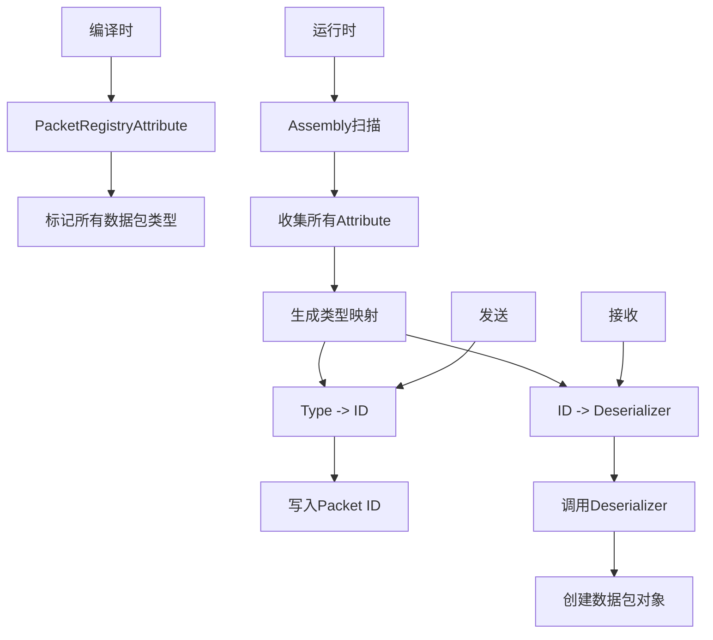

**工作流程：**

1. **注册阶段**（静态构造函数）：
   - 扫描 Assembly 中的 `PacketRegistryAttribute`
   - 为每个数据包类型分配唯一 ID（从 1 开始）
   - 创建 ID 到反序列化器的映射
   - 创建类型到 ID 的映射

2. **序列化阶段**：
   ```csharp
   PacketRegistry.WritePacket(packet, ref writer);
   // 1. 查找 packet 类型对应的 ID
   // 2. 写入 ID
   // 3. 调用 packet.Serialize()
   ```

3. **反序列化阶段**：
   ```csharp
   IPacket packet = PacketRegistry.ReadPacket(id, ref reader);
   // 1. 根据 ID 查找反序列化器
   // 2. 调用反序列化器创建对象
   ```

### 数据包标记

使用 `PacketRegistryAttribute` 标记数据包类型：

```csharp
[assembly: PacketRegistry(typeof(PacketPlayerFrame))]
[assembly: PacketRegistry(typeof(PacketChatMessage))]
// ...
```

这确保了客户端和服务器使用相同的 ID 映射。

## 握手协议

握手是建立连接的第一步，用于版本验证和初始化。

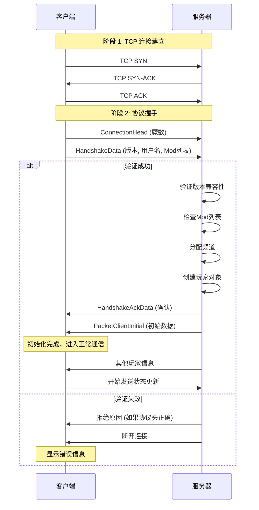

### HandshakeData 结构

```csharp
public sealed class HandshakeData
{
    public Version Version { get; }      // 客户端版本
    public byte LangCode { get; }        // 语言代码
    public string Name { get; }          // 玩家名称
    public IReadOnlyList<NetMod> NetMods { get; }  // 已安装的Mod列表
    
    public sealed class NetMod
    {
        public Version Version { get; set; }  // Mod版本
        public string Name { get; set; }      // Mod名称
    }
}
```

### PacketClientInitial 结构

服务器发送的初始化数据包，包含客户端需要的所有初始信息：

```csharp
public sealed class PacketClientInitial
{
    public PlayerInfo SelfPlayerInfo { get; }              // 自己的玩家信息
    public IReadOnlyCollection<ChannelInfo> Channels { get; }  // 频道列表
    public IReadOnlyCollection<Player> Players { get; }    // 当前在线玩家列表
    
    public struct Player
    {
        public int ChannelID { get; }                 // 所在频道
        public PlayerInfo PlayerInfo { get; }         // 玩家基本信息
        public PlayerLocation Location { get; }       // 位置信息
        public PlayerGraphicsInfo? GraphicsInfo { get; }  // 图形信息（可选）
        public PlayerState? State { get; }            // 状态信息（可选）
    }
}
```

## 连接流程详解

### 完整的连接建立流程

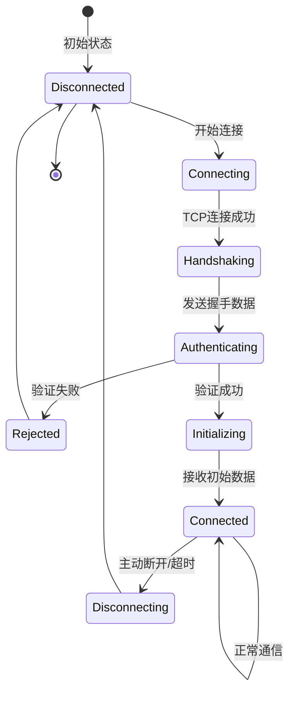

### 连接状态说明

1. **Disconnected**: 未连接状态
2. **Connecting**: 正在建立 TCP 连接
3. **Handshaking**: 正在发送连接头
4. **Authenticating**: 正在进行身份验证
5. **Initializing**: 正在接收初始数据
6. **Connected**: 已连接，正常通信中
7. **Disconnecting**: 正在断开连接
8. **Rejected**: 连接被服务器拒绝

## 帧同步协议

### 玩家帧数据同步

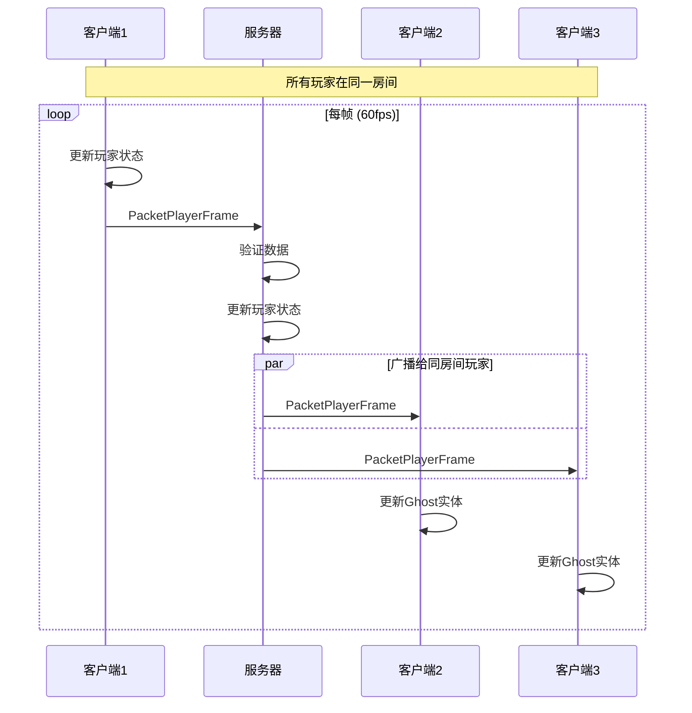

### PacketPlayerFrame 结构

```csharp
public sealed class PacketPlayerFrame
{
    public Vector2 Position { get; }         // 玩家位置
    public ushort AnimationID { get; }       // 动画ID
    public ushort AnimationFrame { get; }    // 动画帧
    public Vector2 Scale { get; }            // 缩放
    public FrameFlags Flags { get; }         // 标志位
    public byte Dashes { get; set; }         // 冲刺数（条件包含）
    
    [Flags]
    public enum FrameFlags : ushort
    {
        FacingLeft = 1 << 0,    // 朝向左
        StartDash = 1 << 1,     // 开始冲刺
        EndDash = 1 << 2,       // 结束冲刺
        DashesChange = 1 << 3   // 冲刺数改变
    }
}
```

**优化点：**
- 总大小约 26 字节（不含冲刺数变化时）
- 使用标志位减少条件字段
- 只在冲刺数变化时才传输该字段

### 地图变更同步

当玩家切换地图或房间时：

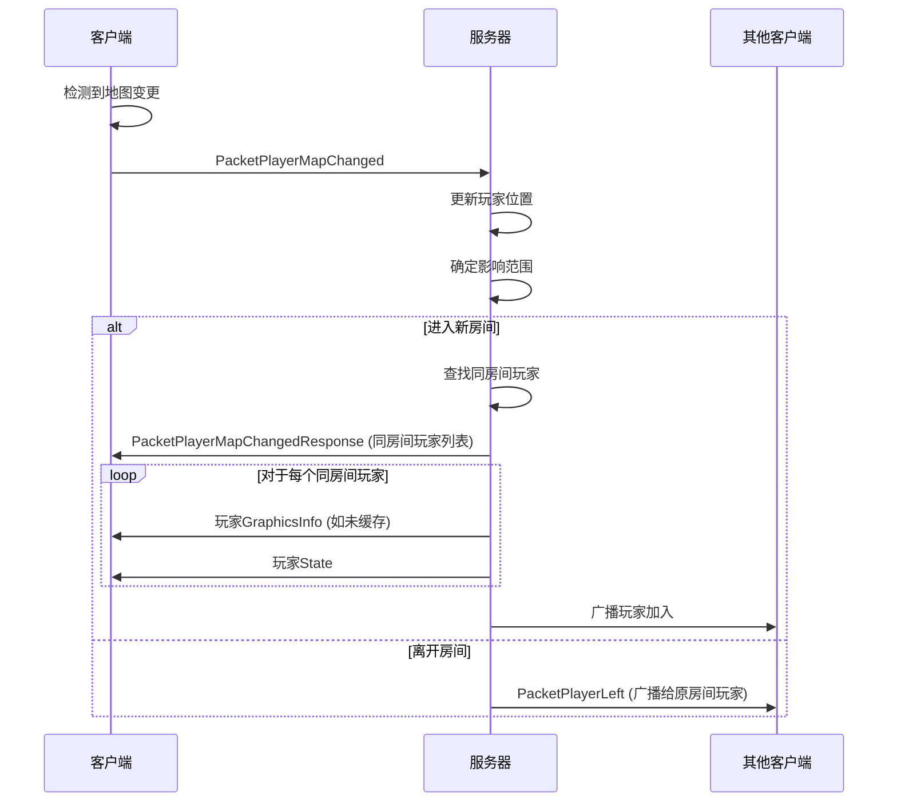

## 聊天协议

### 聊天消息流程

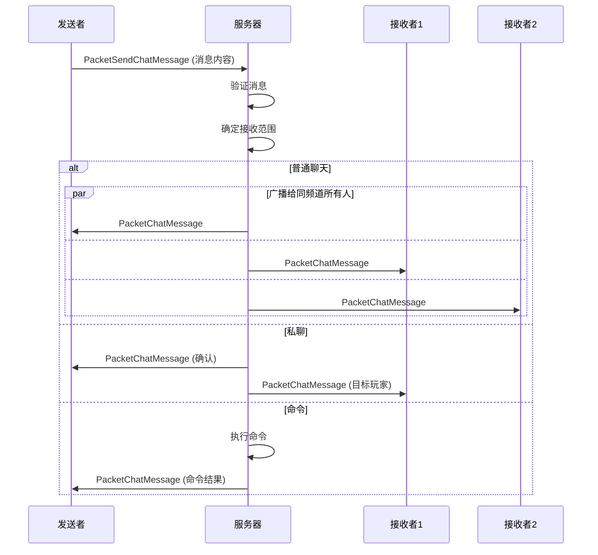

### PacketChatMessage 结构

```csharp
public sealed class PacketChatMessage
{
    public ChatMessageType Type { get; set; }     // 消息类型
    public int? SourcePlayer { get; set; }        // 发送者ID（可选）
    public string Content { get; set; }           // 消息内容
}

public enum ChatMessageType : byte
{
    Chat,           // 普通聊天
    PrivateMessage, // 私聊
    Server,         // 服务器消息
    ServerChat      // 服务器聊天
}
```

## 优化的广播机制

### SerializedPacket

服务器使用 `SerializedPacket` 优化广播性能：

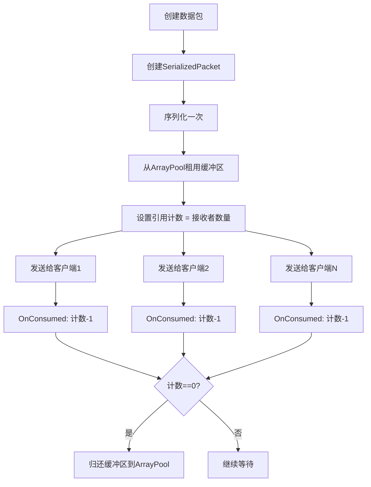

**优势：**
- 序列化一次，发送多次
- 自动内存管理，无内存泄漏
- 减少 GC 压力

## 频道管理协议

### 频道切换流程

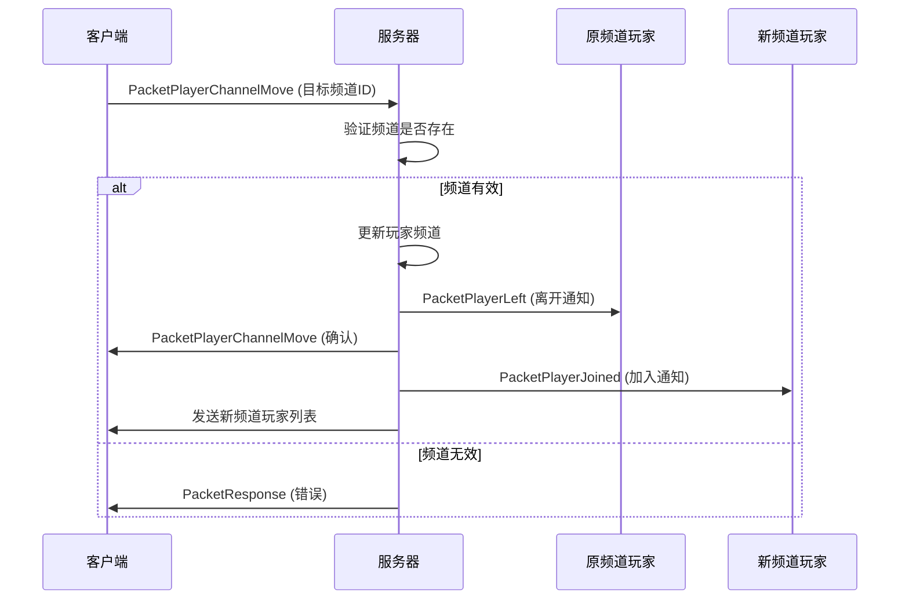

## 表情系统协议

### 表情发送流程

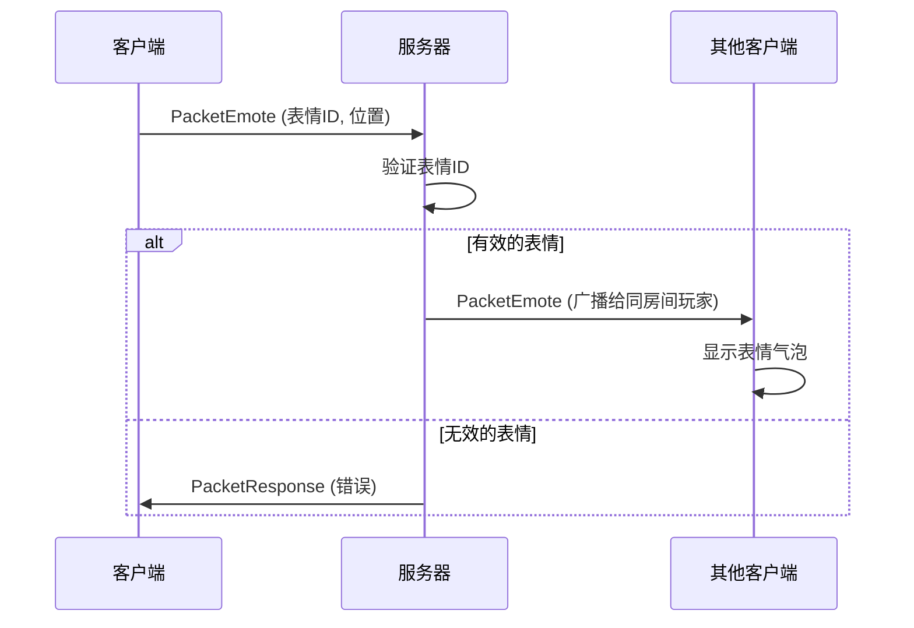

## 断开连接协议

### 正常断开

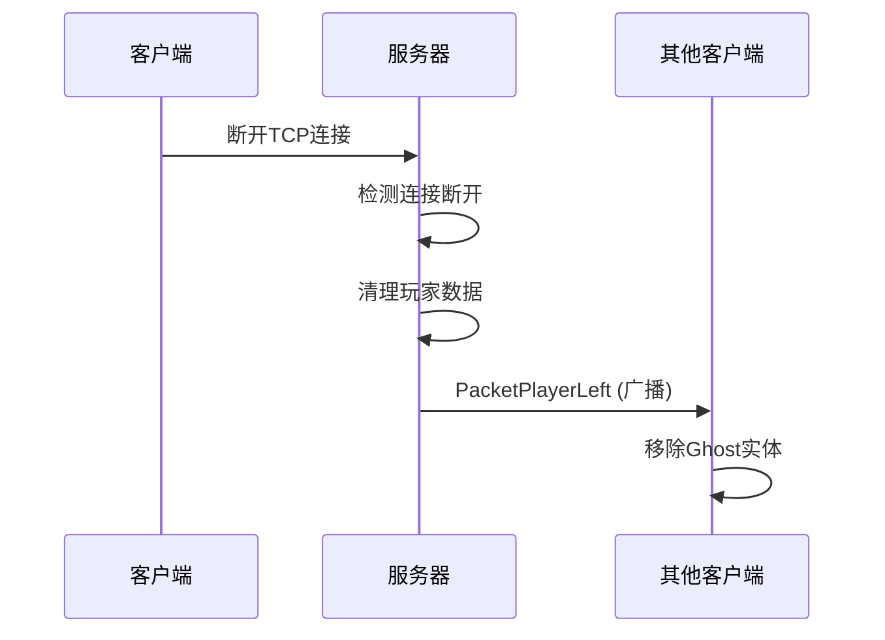

### 被踢出

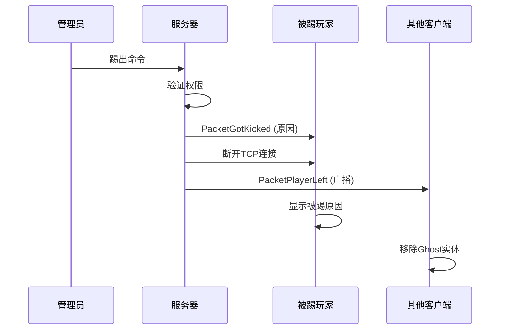

## 协议扩展性

### 未来计划

1. **UDP 支持**:
   - `PacketFlags.PreferUdp` 标志已预留
   - 用于低延迟的帧数据传输
   - TCP 作为可靠通道的备份

2. **TLS 加密**:
   - 在 TCP 层之上添加 TLS
   - 保护数据传输安全
   - 防止中间人攻击

3. **压缩**:
   - 对大数据包进行压缩
   - 减少带宽使用
   - 可选的压缩算法

## 性能指标

### 典型数据包大小

| 数据包类型 | 大小（字节） | 频率 |
|-----------|------------|------|
| PacketPlayerFrame | ~26 | 60 次/秒 |
| PacketChatMessage | ~20-100 | 按需 |
| PacketPlayerJoined | ~50 | 按需 |
| PacketPlayerLeft | ~8 | 按需 |
| PacketEmote | ~20 | 按需 |

### 带宽估算

**每个玩家（60fps 帧同步）：**
- 发送: 26 字节 × 60 = 1.56 KB/秒 ≈ 12.5 Kbps
- 接收: 26 字节 × 60 × N (N=同房间玩家数)

**100 个玩家，平均每房间 5 人：**
- 每玩家接收: 26 × 60 × 4 = 6.24 KB/秒 ≈ 50 Kbps
- 服务器总流量: ~6 Mbps (上行+下行)

## 错误处理

### 协议错误

- **版本不匹配**: 拒绝连接
- **无效的数据包 ID**: 断开连接
- **数据包过大**: 断开连接
- **反序列化失败**: 忽略数据包或断开连接

### 网络错误

- **连接超时**: 自动重连（客户端）
- **心跳超时**: 断开连接（服务器）
- **TCP 错误**: 断开连接，清理资源

## 相关文档

- [架构设计 (Architecture.md)](./Architecture.md) - 系统架构
- [数据结构 (DataStructures.md)](./DataStructures.md) - 数据结构详解
- [数据包参考 (PacketReference.md)](./PacketReference.md) - 所有数据包定义
