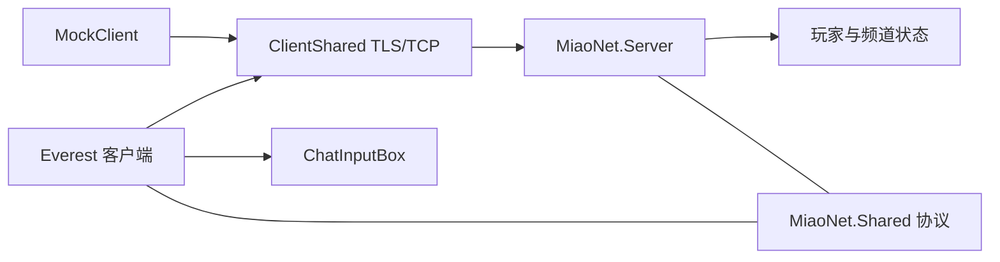

# 架构设计

```mermaid
flowchart LR
    Client[Everest 客户端] --> Connection[ClientShared TLS/TCP]
    Mock[MockClient] --> Connection
    Connection --> Server[MiaoNet.Server]
    Server --> State[玩家与频道状态]
    Client --> Chat[ChatInputBox]
    Client --- Shared[MiaoNet.Shared 协议]
    Server --- Shared
```

## 通关分享流程
Everest 通关结算 → 冻结记录到 Mod SaveData → `/shareclear` → 服务端验证并全局广播 → 接收客户端添加可变高度卡片。

## 架构决策
- ADR-001：通关分享采用专用结构化消息；详见 [技术设计](../history/2026-10/202610282121_clear_share/how.md)。
